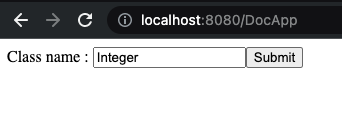
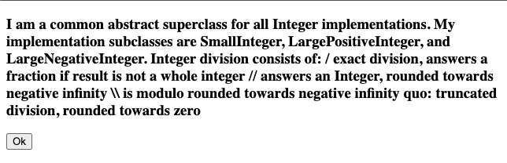

# Inria Internship exercises

#### Author: **_Zakaria ELKHAYARI_**

## LinkedList


#### Class ALink

This is a link( or a node).

**Methods :**

- nextlink - return the next link
- nextlink: - set next link
- value - return the nodes value
- value: - set nodes value
- clearLinks - remove reference to next link

#### Class ALinkedList

This is the linked list class.

**Methods :**

- add: - add node to linkedlist
- addLast: - add node to end of linkedlist
- asArray - return linkedlist as an orderedCollection
- first - return first node on linkedlist
- last - return last node on linkedlist
- isEmpty - check if linkedlist is empty
- removeAll - empty the linkedlist
- removeFirst - remove first node from linkedlist
- removeLast - remove last node from linkedlist
- head: - set the first node
- head - return the first node
- tail: - set the last node
- tail - return the last node

#### Tests 

- testAddElement - test case to add element
- testAddElementCorrectly - test case to add element correctly
- testFirstElement - test case to get the first element
- testLastElement - test case to get the last element
- testRemoveAll - test case to remove all elements
- testRemoveFirst - test case to remove first element
- testRemoveLast - test case to remove last element


## Small java doc


#### Class DocApp

This is a program that takes a pharo class and produces a little HTML description of the class.

**Methods :**

- theClass - return the class
- theClass: - set the class
- description - return a HTML description of the class

#### Class WADocApp

Seaside component that uses the DocApp to display the description of a given class

**Usage :**

Open a playground (Command + O + W), execute the following code :

```Smalltalk
ZnZincServerAdaptor startOn: 8080.
WADocApp initialize
```

Then open [http://localhost:8080/DocApp](http://localhost:8080/DocApp)



